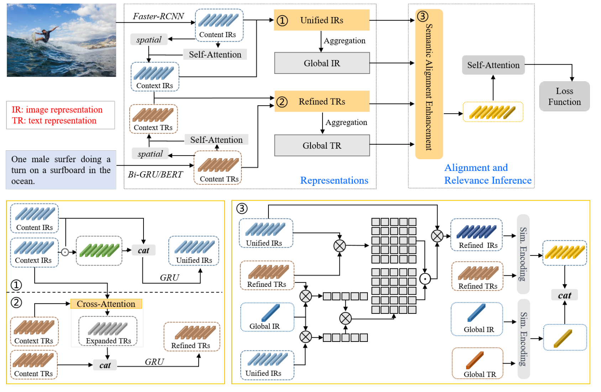

# A Mutually Textual and Visual Refinement Network for Image-Text Matching

## Introduction



## Requirements and Installation

Python	3.6

PyTorch	1.8.0

Transformers	4.18.0

Please refer to the （[environment.yaml](environment.yaml)） file for the specific environment


## Results

#### Results on COCO 5-fold 1K Test Split

|      | Visual Backbone | Text Backbone | R1       | R5       | R1       | R5       |
| ---- | --------------- | ------------- | -------- | -------- | -------- | -------- |
| TVRN | BUTD region     | GRU-base      | **79.6** | **96.0** | **64.2** | **90.7** |
| TVRN | BUTD region     | BERT-base     | **81.1** | **96.4** | **67.7** | **92.3** |

#### Results on Flickr30K Test Split

|      | Visual Backbone | Text Backbone | R1       | R5       | R1       | R5       |
| ---- | --------------- | ------------- | -------- | -------- | -------- | -------- |
| TVRN | BUTD region     | GRU-base      | **79.7** | **95.4** | **62.3** | **85.3** |
| TVRN | BUTD region     | BERT-base     | **82.1** | **95.6** | **63.9** | **87.6** |


## Data

```
data
├── coco
│   ├── precomp  # pre-computed BUTD region features for COCO, provided by SCAN
│   │      ├── train_ids.txt
│   │      ├── train_caps.txt
│   │      ├── ......
├── f30k
│   ├── precomp  # pre-computed BUTD region features for Flickr30K, provided by SCAN
│   │      ├── train_ids.txt
│   │      ├── train_caps.txt
│   │      ├── ......
└── vocab  # vocab files provided by SCAN (only used when the text backbone is BiGRU)
```


## Training

```
sh scripts/train.sh
```


## Evaluation

```
sh scripts/eval.sh
```


